# Runtime PR Verification - Technical Documentation

## 🚀 Deployment Guide

### Prerequisites

1. **GitHub Repository**: Your repository must use GitHub Actions
2. **Firebase Project**: Active Firebase project with Hosting enabled
3. **Firebase Service Account**: Service account with appropriate permissions
4. **Firebase Storage Bucket**: For storing screenshots and videos

### Step 1: Create Firebase Service Account

1. Go to [Firebase Console](https://console.firebase.google.com)
2. Select your project → Project Settings → Service Accounts
3. Click "Generate new private key"
4. Download the JSON file (keep this secure!)

**Required permissions for the service account:**
- `firebasehosting.sites.get`
- `firebasehosting.versions.list`
- `storage.buckets.get`
- `storage.objects.create`
- `storage.objects.delete`
- `storage.objects.get`
- `storage.objects.list`

### Step 2: Encode Service Account for GitHub

```bash
# Convert service account JSON to base64
base64 -i path/to/service-account.json | tr -d '\n' > firebase-sa-base64.txt

# On macOS:
base64 -i path/to/service-account.json | pbcopy
# The base64 string is now in your clipboard
```

### Step 3: Configure GitHub Secrets

1. Go to your repository → Settings → Secrets and variables → Actions
2. Add these **Repository Secrets**:

| Secret Name | Description | How to Get |
|------------|-------------|------------|
| `FIREBASE_SA_BASE64` | Base64 encoded service account JSON | From Step 2 above |
| `FIREBASE_TOKEN` | Firebase CLI token (optional) | Run `firebase login:ci` |
| `GEMINI_API_KEY` | Google AI API key for Gemini | [Get from Google AI Studio](https://aistudio.google.com/app/apikey) |

### Step 4: Configure GitHub Variables

1. Still in Settings → Secrets and variables → Actions
2. Switch to the **Variables** tab
3. Add these **Repository Variables**:

| Variable Name | Description | Example |
|--------------|-------------|----------|
| `FIREBASE_PROJECT_ID` | Your Firebase project ID | `my-app-12345` |
| `FIREBASE_STORAGE_BUCKET` | Storage bucket name | `my-app-12345.appspot.com` |
| `FIREBASE_TARGET` | Hosting target (optional) | `app` or `loop-qc` |

### Step 5: Deploy the Action

**Option A: Use from GitHub Marketplace (Recommended)**
```yaml
# In your workflow file
- uses: LoopKitchen/runtime-pr-verification@v1
  with:
    preview-url: ${{ needs.deploy.outputs.preview_url }}
    firebase-credentials: ${{ secrets.FIREBASE_SA_BASE64 }}
    storage-bucket: ${{ vars.FIREBASE_STORAGE_BUCKET }}
    github-token: ${{ secrets.GITHUB_TOKEN }}
```

**Option B: Fork and Deploy Your Own**
1. Fork this repository
2. Enable GitHub Actions in your fork
3. Create a release/tag (e.g., `v1.0.0`)
4. Reference in workflows: `uses: your-org/runtime-pr-verification@v1.0.0`

### Step 6: Storage Bucket Configuration

1. Go to Firebase Console → Storage
2. If not created, click "Get Started"
3. Choose location closest to your users
4. Set up storage rules:

```javascript
// storage.rules
rules_version = '2';
service firebase.storage {
  match /b/{bucket}/o {
    // Allow service account to read/write
    match /runtime-pr-verification/{allPaths=**} {
      allow read, write: if request.auth != null;
    }
    
    // Optional: Allow public read for screenshots
    match /runtime-pr-verification/{pr}/screenshots/{image} {
      allow read: if true;
    }
  }
}
```

### Complete Configuration Reference

| Input | Required | Description | Default | Example |
|-------|----------|-------------|---------|----------|
| `preview-url` | ✅ | Firebase preview URL | - | `https://app--pr-123-app.web.app` |
| `firebase-credentials` | ✅ | Base64 service account | - | `${{ secrets.FIREBASE_SA_BASE64 }}` |
| `storage-bucket` | ✅ | Storage bucket name | - | `my-app.appspot.com` |
| `github-token` | ✅ | GitHub token | - | `${{ secrets.GITHUB_TOKEN }}` |
| `firebase-project-id` | ❌ | Override project ID | Auto-detected | `my-app-12345` |
| `firebase-target` | ❌ | Hosting target | Auto-detected | `app`, `loop-qc` |
| `build-system` | ❌ | Build system | Auto-detected | `vite`, `react` |
| `viewports` | ❌ | Test viewports | See below | `1920x1080:Desktop` |
| `test-timeout` | ❌ | Test timeout | `5m` | `8m` |
| `max-routes` | ❌ | Max routes to test | `10` | `15` |
| `cleanup-days` | ❌ | Storage cleanup | `7` | `14` |
| `gemini-bot-name` | ❌ | Gemini bot username | `gemini[bot]` | `gemini-reviewer` |
| `fail-on-errors` | ❌ | Fail on test errors | `false` | `true` |

**Default Viewports:**
```
1920x1080:Desktop,1366x768:Laptop,768x1024:Tablet,375x667:Mobile
```

### Troubleshooting Deployment

**Error: "Input required and not supplied: preview-url"**
- Ensure your deploy job outputs the preview URL
- Check the job dependency with `needs: [deploy]`

**Error: "Failed to initialize Firebase Admin"**
- Verify service account JSON is valid
- Check base64 encoding (no line breaks)
- Ensure service account has required permissions

**Error: "Storage bucket not found"**
- Verify bucket name matches your Firebase project
- Ensure Storage is enabled in Firebase Console
- Check service account has storage permissions

**Error: "Failed to find Gemini analysis"**
- Ensure Gemini bot has commented on the PR
- Check `gemini-bot-name` matches your bot's username
- Verify the job dependency order

## 🏗️ Architecture Overview

This GitHub Action provides comprehensive runtime verification for React SPAs deployed to Firebase Hosting, with intelligent integration of Gemini AI code review analysis.

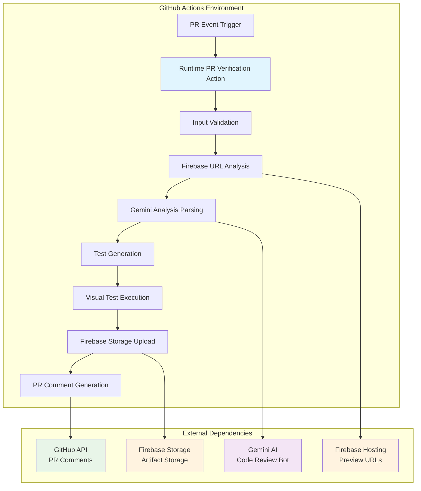

## 🔧 Core Components Architecture

### Component Interaction Flow

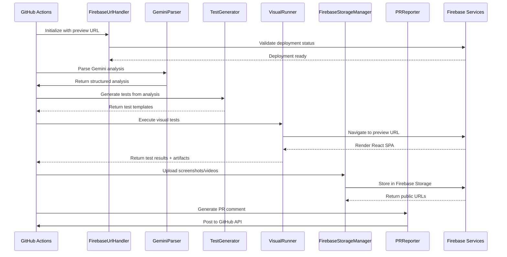

## 📁 File Structure & Responsibilities

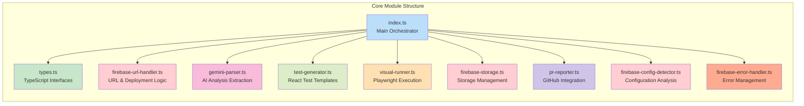

## 🔄 Data Flow Architecture

### Input Processing Flow

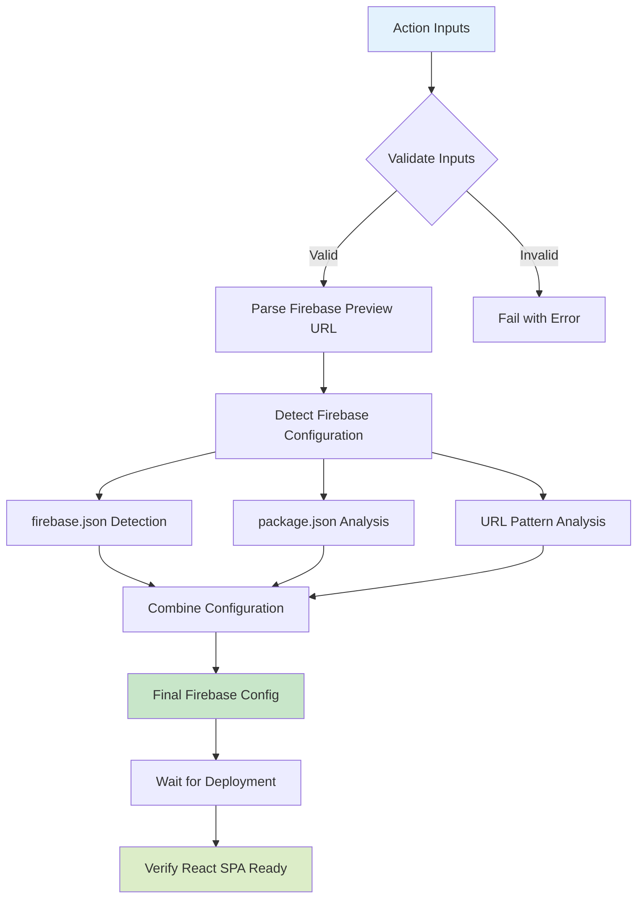

### Test Generation Flow

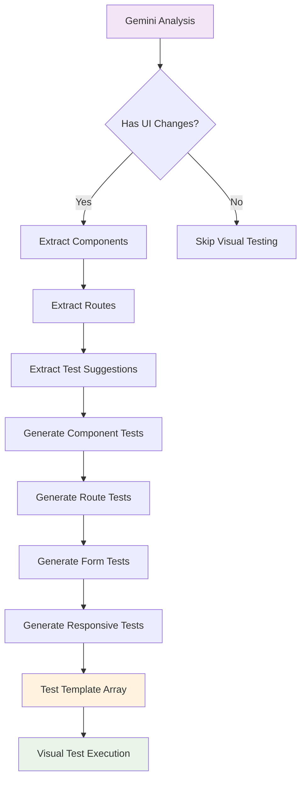

## 🎯 Firebase Integration Architecture

### Multi-Target Support System

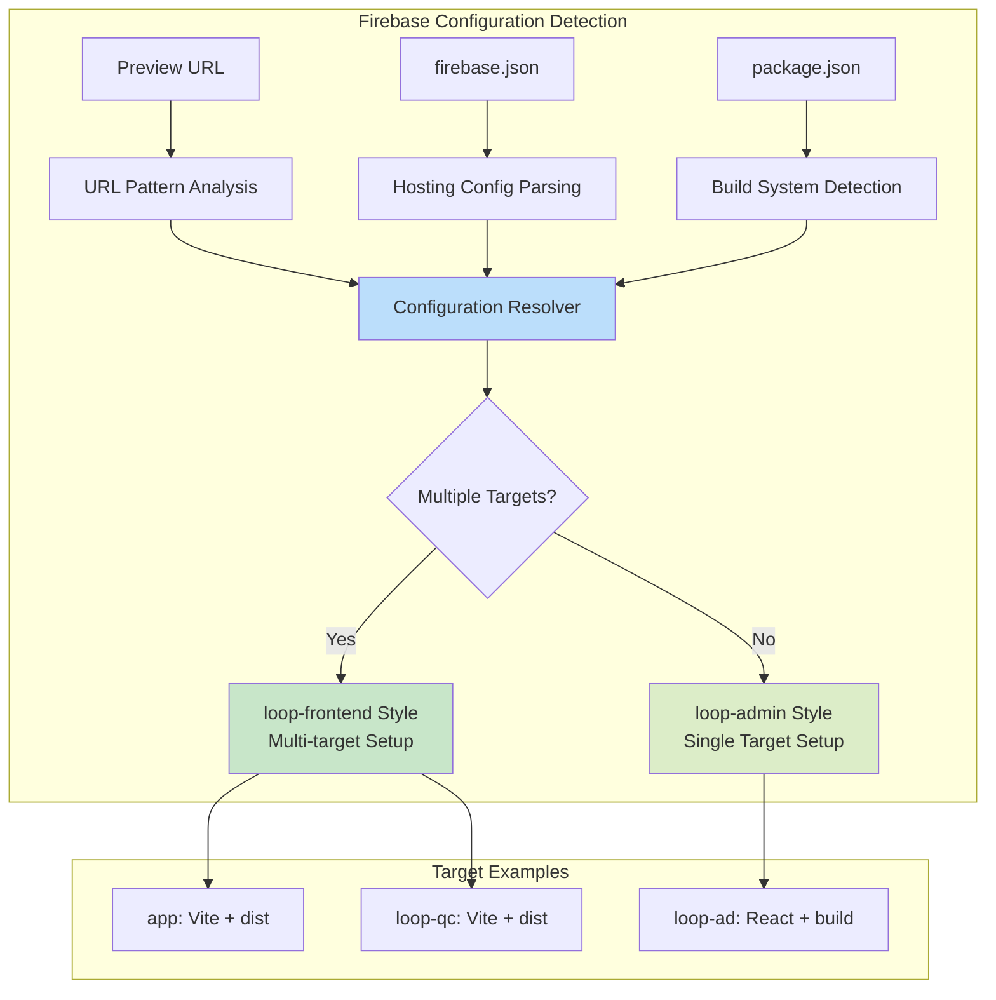

### Firebase Storage Organization

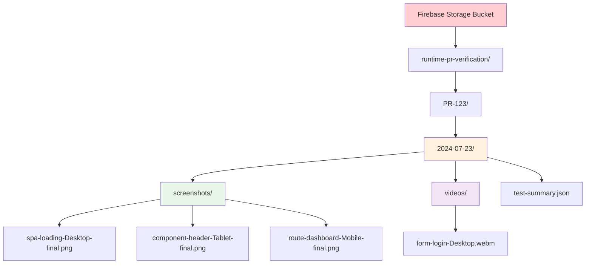

## 🧪 Test Generation System

### React Component Test Templates

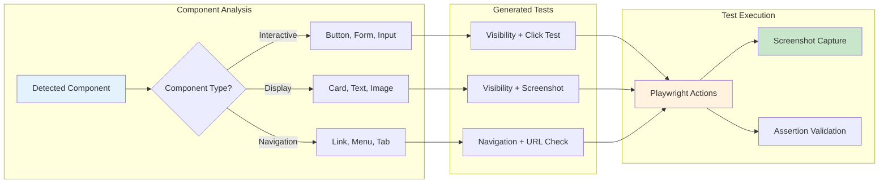

### React Router Integration

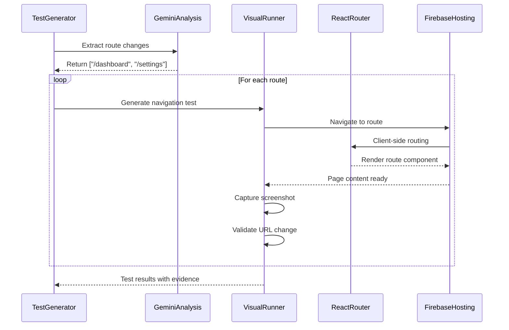

## 🎨 Visual Testing Engine

### Playwright Integration Architecture

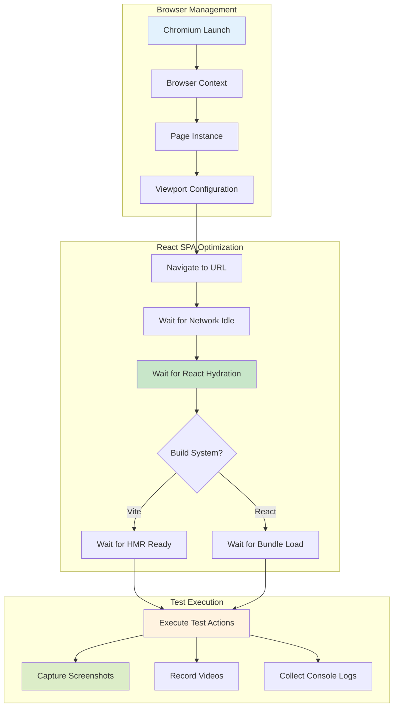

### Multi-Viewport Testing Strategy

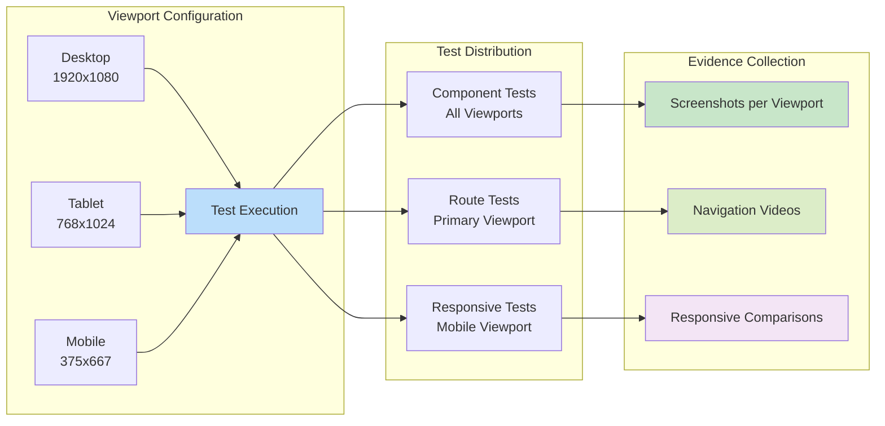

## 🤖 Gemini AI Integration

### Analysis Parsing System

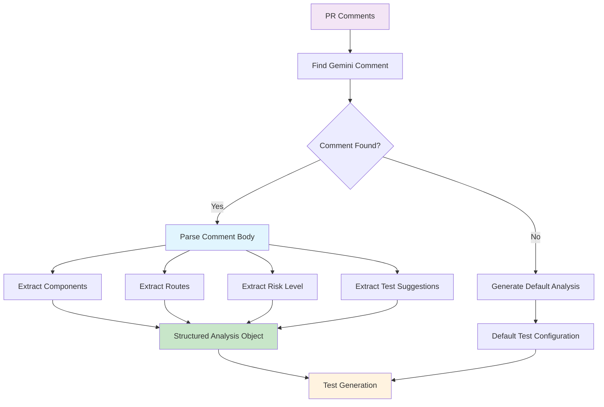

### Pattern Recognition System

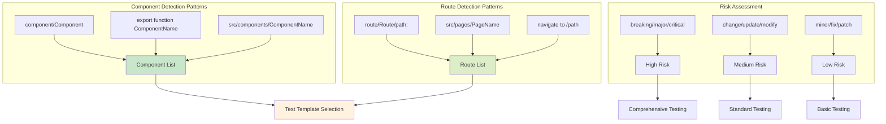

## 🔐 Error Handling Architecture

### Comprehensive Error Classification

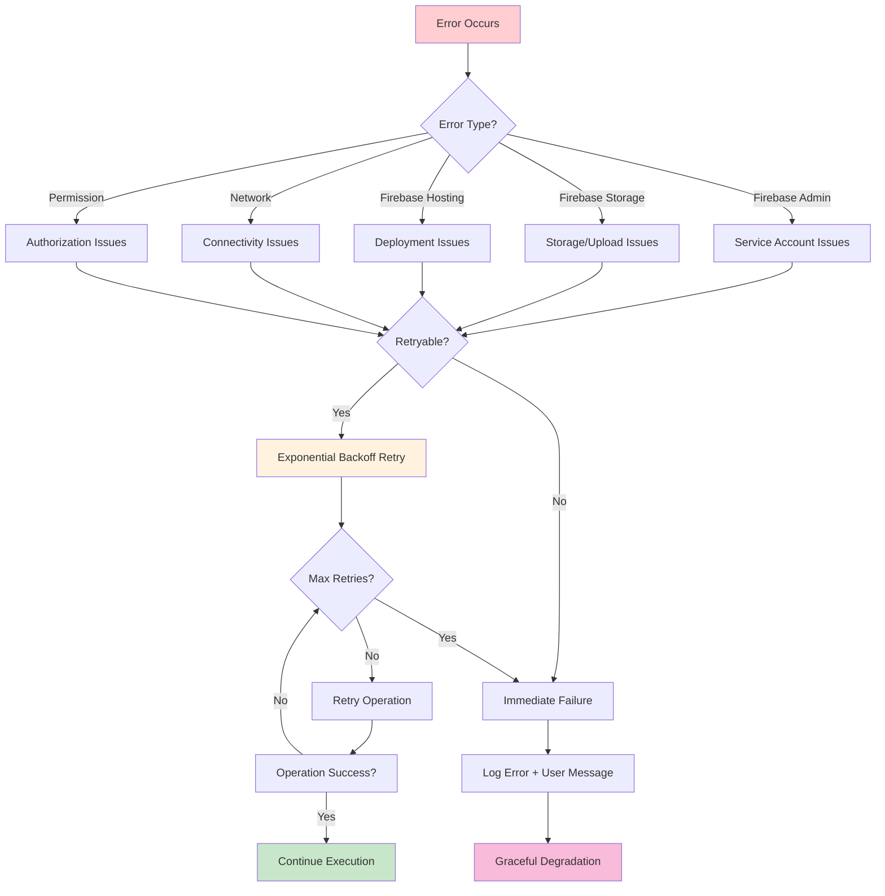

### Error Recovery Strategies

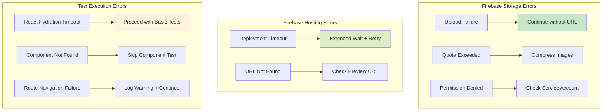

## 📊 Performance Optimization Strategy

### Execution Timeline Optimization

```mermaid
gantt
    title Runtime PR Verification Timeline
    dateFormat s
    axisFormat %s
    
    section Initialization
    Input Validation           :done, task1, 0, 5
    Firebase Config Detection  :done, task2, after task1, 10
    Deployment Wait           :done, task3, after task2, 30
    
    section Analysis
    Gemini Parsing            :done, task4, after task3, 10
    Test Generation           :done, task5, after task4, 10
    
    section Execution
    Browser Launch            :done, task6, after task5, 10
    Visual Tests              :active, task7, after task6, 105
    Screenshot Capture        :crit, task8, after task7, 30
    
    section Upload
    Firebase Storage Upload   :task9, after task8, 30
    PR Comment Generation     :task10, after task9, 10
    
    section Cleanup
    Browser Cleanup           :task11, after task10, 10
    Temp File Cleanup         :task12, after task11, 10
```

### Parallel Operations Strategy

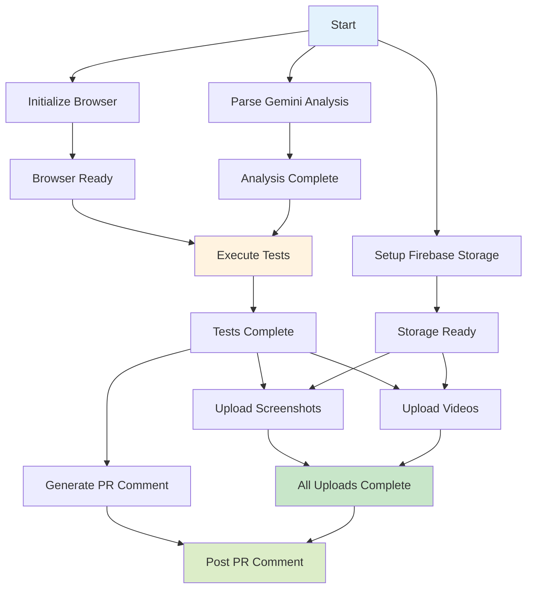

## 🔄 CI/CD Integration Patterns

### GitHub Actions Workflow Integration

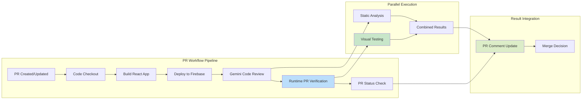

### Multi-Repository Usage Pattern

```mermaid
graph TB
    subgraph CAR[Central Action Repository]
        A[runtime-pr-verification@v1]
    end
    
    subgraph CR[Consumer Repositories]
        B[loop-frontend<br/>Vite + Multi-target]
        C[loop-admin<br/>React + Single-target]
        D[Other React SPAs]
    end
    
    subgraph CV[Configuration Variations]
        E[Custom Viewports]
        F[Extended Timeouts]
        G[Specific Firebase Targets]
    end
    
    A --> B
    A --> C
    A --> D
    
    B --> E
    C --> F
    D --> G
    
    style A fill:#e1f5fe
    style B fill:#c8e6c9
    style C fill:#dcedc8
    style D fill:#fff3e0
```

## 📈 Monitoring & Analytics

### Action Performance Metrics

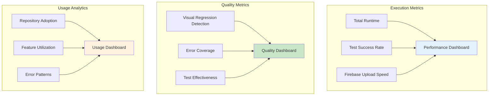

## 🔧 Development & Debugging

### Local Development Setup

```mermaid
flowchart TD
    A[Clone Repository] --> B[Install Dependencies]
    B --> C[Setup Environment Variables]
    C --> D[Run Local Tests]
    
    D --> E{Test Type?}
    E -->|Unit Tests| F[Jest Test Suite]
    E -->|Integration Tests| G[Local Test Runner]
    E -->|Manual Testing| H[Target Firebase URL]
    
    F --> I[Validation Complete]
    G --> J[Mock Firebase Services]
    H --> K[Real Firebase Integration]
    
    J --> I
    K --> I
    
    style A fill:#e3f2fd
    style I fill:#c8e6c9
```

### Debug Information Flow

```mermaid
sequenceDiagram
    participant DEV as Developer
    participant LT as Local Test Runner
    participant FA as Firebase Action
    participant LOG as Action Logs
    
    DEV->>LT: npm run test:local --url=...
    LT->>FA: Initialize with debug config
    FA->>LOG: Log configuration details
    FA->>LOG: Log Firebase detection results
    FA->>LOG: Log test generation process
    FA->>LOG: Log test execution results
    FA->>LOG: Log upload progress
    LOG-->>DEV: Comprehensive debug output
```

## 🚀 Deployment Strategy

### Release Management

```mermaid
flowchart LR
    A[Development] --> B[Feature Branch]
    B --> C[Pull Request]
    C --> D[Code Review]
    D --> E[Integration Tests]
    E --> F[Merge to Main]
    F --> G[Automated Release]
    G --> H[Version Tag]
    H --> I[GitHub Marketplace]
    
    subgraph "Version Strategy"
        J[v1.x.x - Major Features]
        K[v1.x.x - Minor Enhancements]
        L[v1.x.x - Bug Fixes]
    end
    
    H --> J
    H --> K
    H --> L
    
    style G fill:#bbdefb
    style I fill:#c8e6c9
```

## 📚 Usage Examples

### Basic Implementation

```yaml
# .github/workflows/pr-verification.yml
name: PR Verification
on:
  pull_request:
    types: [opened, synchronize]

jobs:
  visual-verification:
    runs-on: ubuntu-latest
    steps:
      - uses: your-org/runtime-pr-verification@v1
        with:
          preview-url: ${{ needs.deploy.outputs.preview_url }}
          firebase-credentials: ${{ secrets.FIREBASE_SA_BASE64 }}
          storage-bucket: ${{ vars.FIREBASE_STORAGE_BUCKET }}
          github-token: ${{ secrets.GITHUB_TOKEN }}
```

### Advanced Configuration

```yaml
# Advanced configuration for loop-frontend
- uses: your-org/runtime-pr-verification@v1
  with:
    preview-url: ${{ needs.deploy.outputs.preview_url }}
    firebase-credentials: ${{ secrets.FIREBASE_SA_BASE64 }}
    storage-bucket: 'loop-frontend-screenshots'
    github-token: ${{ secrets.GITHUB_TOKEN }}
    firebase-target: 'app'
    build-system: 'vite'
    viewports: '1920x1080:Desktop,768x1024:Tablet,390x844:Mobile'
    test-timeout: '8m'
    max-routes: '15'
    cleanup-days: '14'
```

## 🎯 Quick Deployment Checklist

Here's everything you need to deploy this action in your repository:

### ✅ Required Secrets (Settings → Secrets → Actions → New repository secret)
1. **`FIREBASE_SA_BASE64`** - Your Firebase service account JSON encoded in base64
   ```bash
   base64 -i service-account.json | pbcopy  # Copies to clipboard on macOS
   ```
2. **`GEMINI_API_KEY`** - Get from [Google AI Studio](https://aistudio.google.com/app/apikey)
3. **`FIREBASE_TOKEN`** (optional) - Run `firebase login:ci` if not using service account

### ✅ Required Variables (Settings → Secrets → Actions → Variables tab)
1. **`FIREBASE_PROJECT_ID`** - Your Firebase project ID (e.g., `my-app-12345`)
2. **`FIREBASE_STORAGE_BUCKET`** - Usually `{project-id}.appspot.com`

### ✅ Minimum Workflow Configuration
```yaml
# .github/workflows/pr-checks.yml
name: PR Visual Verification
on:
  pull_request:
    types: [opened, synchronize]

jobs:
  # Your existing deploy job that outputs preview_url
  deploy:
    outputs:
      preview_url: ${{ steps.deploy.outputs.preview_url }}
    # ... your deployment steps ...

  # Add this job for visual verification
  visual-verification:
    needs: [deploy]  # Make sure deploy completes first
    runs-on: ubuntu-latest
    steps:
      - uses: LoopKitchen/runtime-pr-verification@v1
        with:
          preview-url: ${{ needs.deploy.outputs.preview_url }}
          firebase-credentials: ${{ secrets.FIREBASE_SA_BASE64 }}
          storage-bucket: ${{ vars.FIREBASE_STORAGE_BUCKET }}
          github-token: ${{ secrets.GITHUB_TOKEN }}
```

### 📦 What Gets Stored Where
- **Screenshots**: `gs://{bucket}/runtime-pr-verification/PR-{number}/{date}/screenshots/`
- **Videos**: `gs://{bucket}/runtime-pr-verification/PR-{number}/{date}/videos/`
- **Test Summary**: `gs://{bucket}/runtime-pr-verification/PR-{number}/{date}/test-summary.json`

### 🔒 Firebase Service Account Permissions Needed
- Firebase Hosting Viewer
- Storage Object Admin (for the screenshots bucket)

This technical documentation provides a comprehensive understanding of the Runtime PR Verification Action's architecture, implementation details, and usage patterns. The Mermaid diagrams visualize the complex interactions between components, making it easier to understand the system's behavior and troubleshoot issues.