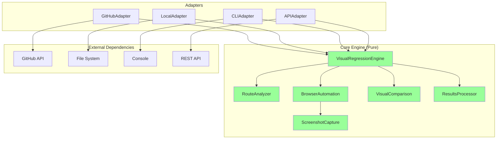

# YoFix Core Engine Isolation Analysis

## Current Architecture (Tightly Coupled)

```mermaid
graph TD
    A[index.ts - GitHub Action Entry] --> B[RouteImpactAnalyzer]
    A --> C[TestGenerator]
    A --> D[VisualAnalyzer]
    A --> E[PRReporter]
    
    B --> F[@actions/core]
    B --> G[@actions/github]
    C --> F
    D --> F
    E --> G
    
    B --> H[GitHub API calls]
    E --> H
    
    style A fill:#ff9999
    style F fill:#ffcc99
    style G fill:#ffcc99
    style H fill:#ff9999
```

**Problems:**
- Core modules depend on `@actions/core` for logging
- RouteImpactAnalyzer requires GitHub token and makes API calls
- PRReporter is mixed with core logic
- Can't run locally without mocking GitHub context

## Current Code Issues

### 1. RouteImpactAnalyzer (Coupled to GitHub)
```typescript
// Current - Tightly coupled
export class RouteImpactAnalyzer {
  private octokit: ReturnType<typeof github.getOctokit>;
  
  constructor(githubToken: string) {
    this.octokit = github.getOctokit(githubToken);
  }
  
  async analyze(prNumber: number): Promise<ImpactTree> {
    // Fetches from GitHub API
    const changedFiles = await this.getChangedFiles(prNumber);
    // Uses core.info for logging
    core.info(`Found ${changedFiles.length} changed files`);
  }
}
```

### 2. TestGenerator (Coupled to Actions)
```typescript
// Current - Uses @actions/core
export class TestGenerator {
  async runTests(analysis: RouteAnalysisResult): Promise<TestResult[]> {
    core.info(`Testing route: ${route}`);
    // Depends on action inputs
    const authEmail = core.getInput('auth-email');
  }
}
```

## Proposed Architecture (Properly Isolated)



## Ideal Implementation

### 1. Core Engine Interface
```typescript
// Pure core engine with no external dependencies
export interface VisualRegressionConfig {
  codebasePath: string;
  previewUrl: string;
  changedFiles: string[];
  options?: {
    viewports?: Viewport[];
    authCredentials?: AuthConfig;
    outputDir?: string;
  };
}

export class VisualRegressionEngine {
  constructor(private config: VisualRegressionConfig) {}
  
  async run(): Promise<VisualRegressionResult> {
    // 1. Extract impacted routes
    const routes = await this.extractImpactedRoutes();
    
    // 2. Visit routes and capture screenshots
    const screenshots = await this.captureScreenshots(routes);
    
    // 3. Analyze visual issues
    const analysis = await this.analyzeScreenshots(screenshots);
    
    // 4. Generate report
    return this.generateReport(analysis);
  }
  
  // Individual steps can be run independently
  async extractImpactedRoutes(): Promise<string[]> { }
  async captureScreenshots(routes: string[]): Promise<Screenshot[]> { }
  async analyzeScreenshots(screenshots: Screenshot[]): Promise<Analysis> { }
  async generateReport(analysis: Analysis): Promise<VisualRegressionResult> { }
}
```

### 2. Adapter Pattern for Different Contexts

```typescript
// GitHub Actions Adapter
export class GitHubActionsAdapter {
  async run() {
    const config = {
      codebasePath: process.cwd(),
      previewUrl: core.getInput('preview-url'),
      changedFiles: await this.getChangedFilesFromPR(),
    };
    
    const engine = new VisualRegressionEngine(config);
    const result = await engine.run();
    
    // Post to GitHub
    await this.postResultsToPR(result);
  }
}

// Local CLI Adapter
export class LocalCLIAdapter {
  async run(args: CLIArgs) {
    const config = {
      codebasePath: args.path || process.cwd(),
      previewUrl: args.url || 'http://localhost:3000',
      changedFiles: await this.getChangedFilesFromGit(),
    };
    
    const engine = new VisualRegressionEngine(config);
    const result = await engine.run();
    
    // Output to console/file
    console.log(result);
    await fs.writeFile('visual-report.json', result);
  }
}

// API Adapter
export class APIAdapter {
  async handleRequest(req: Request): Promise<Response> {
    const config = {
      codebasePath: req.body.repoPath,
      previewUrl: req.body.previewUrl,
      changedFiles: req.body.changedFiles,
    };
    
    const engine = new VisualRegressionEngine(config);
    const result = await engine.run();
    
    return Response.json(result);
  }
}
```

### 3. Usage Examples

```bash
# Local CLI usage
yofix test --url http://localhost:3000 --files "src/components/Button.tsx"

# API usage
curl -X POST http://yofix-api.com/analyze \
  -d '{"repoPath": "/code", "previewUrl": "https://preview.app", "changedFiles": ["src/App.tsx"]}'

# Programmatic usage
import { VisualRegressionEngine } from '@yofix/core';

const engine = new VisualRegressionEngine({
  codebasePath: './my-app',
  previewUrl: 'https://staging.myapp.com',
  changedFiles: ['src/components/Header.tsx']
});

// Run specific steps
const routes = await engine.extractImpactedRoutes();
console.log('Impacted routes:', routes);

const screenshots = await engine.captureScreenshots(routes);
// Save screenshots locally without GitHub
```

## Current State Assessment

### ❌ Not Well Isolated:
1. Core modules import `@actions/core` and `@actions/github`
2. RouteImpactAnalyzer makes GitHub API calls directly
3. Logging is coupled to GitHub Actions
4. Configuration comes from GitHub Action inputs

### ✅ Partially Isolated:
1. Browser-Agent is relatively independent
2. Some analyzers work with just file paths
3. Visual analysis logic is separable

### 🔧 Required Changes for Isolation:

1. **Extract Interfaces**: Define pure interfaces for core functionality
2. **Dependency Injection**: Pass adapters for external services
3. **Configuration Objects**: Replace `core.getInput()` with config objects
4. **Logging Abstraction**: Replace `core.info()` with logger interface
5. **Result Objects**: Return data instead of posting directly

## Recommended Refactoring Path

### Phase 1: Create Core Interfaces
```typescript
export interface Logger {
  info(message: string): void;
  error(message: string): void;
  warning(message: string): void;
}

export interface FileProvider {
  getChangedFiles(): Promise<string[]>;
  readFile(path: string): Promise<string>;
}

export interface ResultPublisher {
  publish(result: VisualRegressionResult): Promise<void>;
}
```

### Phase 2: Refactor Core Modules
- Remove direct GitHub dependencies
- Use dependency injection
- Return results instead of side effects

### Phase 3: Create Adapters
- GitHubActionsAdapter (current functionality)
- LocalCLIAdapter (for local testing)
- APIAdapter (for service integration)

### Phase 4: Package as Library
```json
{
  "name": "@yofix/core",
  "exports": {
    ".": "./dist/index.js",
    "./adapters/github": "./dist/adapters/github.js",
    "./adapters/cli": "./dist/adapters/cli.js"
  }
}
```

## Benefits of Proper Isolation

1. **Local Development**: Run visual tests without GitHub
2. **Integration**: Use in CI/CD pipelines beyond GitHub Actions
3. **Testing**: Easy to unit test without mocking GitHub
4. **Reusability**: Core engine can be used in different contexts
5. **Debugging**: Test individual steps independently

## Example: Running Steps 1-3 Locally

```typescript
// After refactoring
import { VisualRegressionEngine } from '@yofix/core';

async function testLocally() {
  const engine = new VisualRegressionEngine({
    codebasePath: '/Users/me/my-app',
    previewUrl: 'http://localhost:3000',
    changedFiles: ['src/App.tsx', 'src/Button.tsx']
  });
  
  // Step 1: Extract routes
  const routes = await engine.extractImpactedRoutes();
  console.log('Routes:', routes); // ['/dashboard', '/settings']
  
  // Step 2: Capture screenshots
  const screenshots = await engine.captureScreenshots(routes);
  console.log('Screenshots captured:', screenshots.length);
  
  // Step 3: Save locally (no GitHub needed)
  for (const screenshot of screenshots) {
    await fs.writeFile(`./screenshots/${screenshot.route}.png`, screenshot.data);
  }
}
```

## Conclusion

Currently, YoFix's core engine is **not well isolated**. The visual regression logic is tightly coupled to GitHub Actions. To achieve the desired isolation:

1. **Short term**: Create wrapper functions that mock GitHub context
2. **Medium term**: Refactor to use dependency injection
3. **Long term**: Package as a standalone library with adapters

This would enable running the core visual regression engine in any context without requiring GitHub.